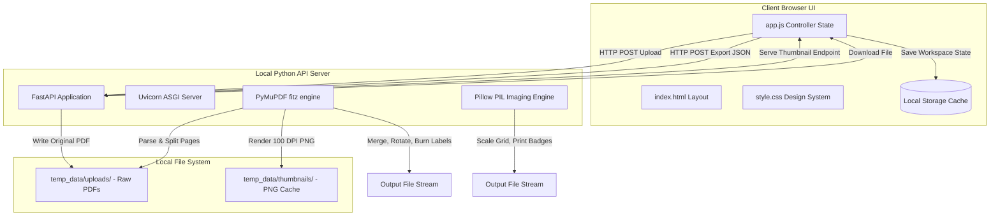
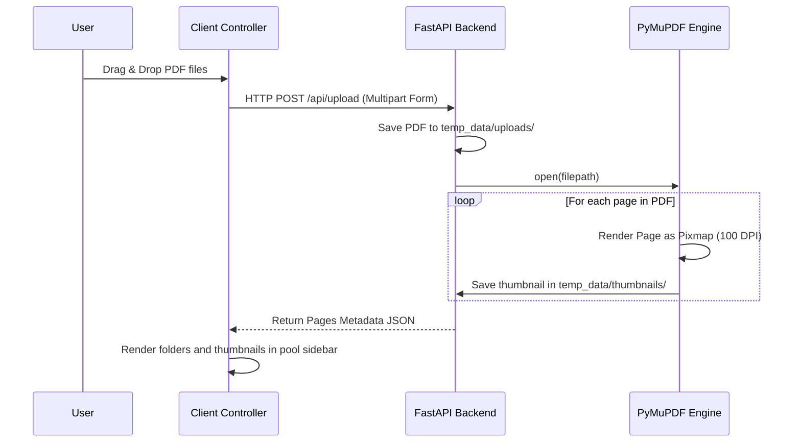
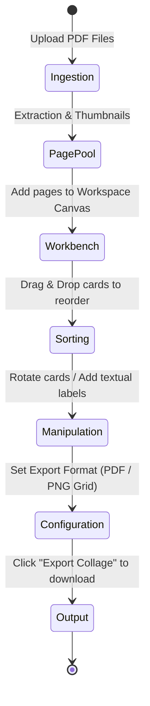

# GridifyPDF - Comprehensive Technical Documentation and Architecture Manual
**Document Version:** 1.0.0  
**Author:** Senior Software Architect & Technical Writer  
**Target Audience:** System Administrators, Developers, DevOps Engineers, and End Users  

---

## 1. Executive Summary

### 1.1 System Overview
**GridifyPDF** is a lightweight, locally-hosted web application designed to reconstruct, manipulate, and compile PDF document pages. It extracts individual pages from uploaded documents, renders high-resolution previews, and allows users to rearrange, rotate, and label pages to generate either restructured PDF packages or custom composite image collages.

### 1.2 Purpose
The system bridges the gap between complex PDF editing suites (e.g., Adobe Acrobat Pro) and simple command-line tools. By executing completely locally on a user's machine, GridifyPDF provides an intuitive graphical interface for visual document compiling without sacrificing data security.

### 1.3 Business Problem Solved
Organizations handling sensitive documentation (financial reports, client records, legal evidence) frequently need to select, reorder, and label document pages. Commercial web services require uploading these files to remote servers, violating strict data privacy laws (such as GDPR, HIPAA, and CCPA). GridifyPDF processes 100% of data locally on the host machine, eliminating cloud-related compliance vulnerabilities.

### 1.4 Key Benefits
*   **Zero Data Leakage:** Files never leave the user's computer.
*   **High Performance:** Local GPU/CPU hardware acceleration handles file conversions instantly.
*   **Intuitive Drag-and-Drop UX:** Simplified controls for rotating, sorting, and labeling.
*   **Dual Export Modes:** Export as a standardized PDF document or a composite multi-column grid image.
*   **Zero Configuration Cost:** Quick local installation via a double-clickable batch launcher script.

---

## 2. Features

*   **Multi-File PDF Upload:** Drag and drop multiple PDF files simultaneously into the staging area.
*   **Instant Page Extraction:** Rapidly splits PDFs into individual pages and renders cached thumbnail previews.
*   **Workspace State Persistence:** Uses browser `localStorage` to save collage configurations across page refreshes or browser restarts.
*   **Multi-Collage Management:** Allows creation, renaming, and switching between multiple custom workspaces in a single session.
*   **Advanced Layout Toggles:** Toggle the main canvas between Grid View, List View, and a single-row Filmstrip View (Horizontal Scrolling Layout).
*   **Granular Page Manipulation:** Adjust orientation (90-degree step rotation) and assign custom textual labels to specific cards.
*   **Dynamic Math Calculations:** Each card includes an input for entering mathematical expressions (e.g. `100+50-20`). The evaluated total is shown on the card and is synced with the preview modal.
*   **Collage Grand Total:** The application tracks and sums all card totals dynamically to present a "Grand Total" inside the summary panel.
*   **Continuous Workspace Zooming:** Scale canvas layout cards from 60% to 140% for better spatial arrangement.
*   **Integrated Lightbox Preview:** Inspect individual pages in detail using an interactive lightbox modal featuring a continuous zoom slider (30% to 200%) and keyboard navigation support.
*   **Dynamic Document Generation:** Compile organized pages into standard PDF documents with customizable burned-in bottom footers or single high-resolution grid images with drop shadows and pill badges.
*   **100% Local & Offline Processing:** Operates independently of internet connectivity with zero external API dependencies.

---

## 3. System Architecture

GridifyPDF uses a decoupled Single Page Application (SPA) architecture served by an asynchronous Python backend. 

### 3.1 Architecture Overview Diagram



### 3.2 Component Roles
*   **Uvicorn Web Server:** Serves as the ASGI server binding to localhost (`127.0.0.1:8000`).
*   **FastAPI Framework:** Handles file upload parsing, serves static directories, provides REST API endpoints, and streams download blobs.
*   **PyMuPDF Engine (`fitz`):** Interacts natively with C-level MuPDF bindings for high-speed page extraction, rotation transformation, and vector text placement on the exported PDF.
*   **Pillow Library:** Performs pixel-perfect grid compositions, canvas stitching, and anti-aliased font rendering for the image collage exports.
*   **Stateful Frontend (JavaScript):** Manages the drag-and-drop index sorting and local workspace caches.

### 3.3 Processing Workflows

#### 3.3.1 Upload & Ingestion Workflow


#### 3.3.2 Export Generation Workflow
```mermaid
sequenceDiagram
    participant User
    participant JS as Client Controller
    participant API as FastAPI Backend
    participant Fitz as PyMuPDF Engine
    participant PIL as Pillow Engine
    
    User->>JS: Click "Export"
    JS->>API: HTTP POST /api/export (JSON config payload)
    alt Format: PDF
        API->>Fitz: Initialize new empty Document
        loop For each card in payload
            API->>Fitz: insert_pdf(src_doc, page_num)
            API->>Fitz: set_rotation(angle)
            API->>Fitz: draw_rect() and insert_textbox(label)
        end
        Fitz-->>API: Write to Bytes
    else Format: Image
        API->>PIL: Create Blank white canvas (W x H)
        loop For each card in payload
            API->>Fitz: Render high-quality Page Pixmap (150 DPI)
            API->>PIL: Load Pixmap to PIL Image
            API->>PIL: img.rotate(angle) and img.resize()
            API->>PIL: canvas.paste() at grid coordinates
            API->>PIL: rounded_rectangle() and draw.text(label)
        </div>
        PIL-->>API: Save Canvas to PNG Bytes
    end
    API-->>JS: Stream binary download block
    JS->>User: Trigger native browser Save dialog
```

---

## 4. Installation Guide

### 4.1 Prerequisites
Before installing GridifyPDF, ensure your system meets the following requirements:
*   **Operating System:** Windows 10 or 11 (64-bit).
*   **Interpreter:** Python 3.10, 3.11, or 3.12.
*   **Web Browser:** Microsoft Edge, Google Chrome, or Mozilla Firefox.

> [!WARNING]
> Ensure Python is added to your Windows environment variables (PATH) during installation. If python is not recognized in the command prompt, the launcher script will fail.

### 4.2 Python Package Installation
To install the system manually, execute the following commands in your command prompt:

```bash
# Verify Python version
python --version

# Upgrade pip to latest version
python -m pip install --upgrade pip

# Navigate to application folder
cd "c:\Users\Martin.Chingwaru\OneDrive - VSO\Documents\Finance-Agent-Lab\.agents\skills\budget review\GridifyPDF"

# Install requirements
pip install -r requirements.txt
```

### 4.3 Content of `requirements.txt`
Ensure the file contains the exact libraries below:
```text
pymupdf>=1.24.0
fastapi>=0.110.0
uvicorn>=0.28.0
python-multipart>=0.0.9
pillow>=10.2.0
httpx2
```

---

## 5. Operating Guide

### 5.1 Starting GridifyPDF via the Launcher Script
We have provided an automated launcher file inside your project folder: **`GridifyPDF.bat`**.

1. Navigate to the project root directory using Windows File Explorer.
2. Double-click **`GridifyPDF.bat`**.
3. A command window will appear, initializing the Uvicorn web server.
4. Your default browser will launch automatically and direct you to: **`http://127.0.0.1:8000`**.

### 5.2 Stopping the Application
To safely shut down the web server:
1. Focus on the active command window running the launcher script.
2. Press **`Ctrl + C`** on your keyboard.
3. If prompted to "Terminate batch job? (Y/N)", type **`Y`** and press **`Enter`**.

### 5.3 Pushing Project to GitHub via the Batch Helper
We have provided an automated Git repository configuration and push script: **`push_to_github.bat`**.

1. Navigate to the project root directory in File Explorer.
2. Double-click **`push_to_github.bat`**.
3. A command window will launch, verify your local git workspace, add the origin remote path (`https://github.com/machingauta79/GridifyPDF.git`), and push your files.
4. If prompted with a browser popup to authorize GitHub, sign in to complete the transfer.

---

## 6. User Guide

### 6.1 Standard Production Workflow



#### Step 1: Uploading Documents
Drag and drop your PDF files into the dashed region in the left-hand panel. Alternatively, click inside the upload box to open a standard file selection dialog. Uploaded documents will render as expandable folders containing visual page thumbnails. The left sidebar panel and page grids include full vertical scrollability (`overflow-y: auto`) with bottom clearance padding, allowing you to scroll up and down effortlessly to view every extracted page from Page 1 to Page N without any clipping.

#### Step 2: Populating the Workbench
To add pages to your current active collage:
*   Click the thumbnail of a specific page to add it individually.
*   Click **Add All to Collage** to copy every page of all uploaded documents onto the canvas grid at once.

#### Step 3: Rearranging Pages
Drag page cards around the canvas workspace. The grid will shift dynamically to display preview slots. Drop the card to finalize its sorted index position.

#### Step 4: Rotation & Custom Labeling
*   **Rotation:** Click the rotate icon on any card to rotate it 90 degrees clockwise.
*   **Labeling:** Type into the input block directly under any card to add a label. Labels are automatically saved.

#### Step 5: Zooming and Previewing Pages
*   **Canvas Scale:** Slide or click the zoom controls (`-` / `+`) at the top of the canvas to scale all cards in the workbench for a wider overview.
*   **Full Screen Inspection:** Click the magnifying glass icon on any card to launch the preview lightbox.
    *   **Scroll View (Fit Width):** Opens by default at full readable document width starting at `scrollTop = 0`. Scroll up and down through the page from top to bottom with your mouse wheel or touchpad.
    *   **Fit Page:** Fits the entire document height inside your window view without scrolling.
    *   **Zoom Slider:** Dynamically scale pages from 30% to 200%, or click the image to toggle view modes. Browse pages end-to-end using the arrow buttons or keyboard Arrow keys.

#### Step 6: Compiling and Downloading
Navigate to the **Export Settings** panel on the right side:
1.  Enter your custom Document Title.
2.  Select **PDF Document** (for pages merged with footers) or **Collage Image** (for a multi-column snapshot).
3.  Choose the column alignment if exporting an image.
4.  Click **Export Collage**. The system will compile the buffer and open a download window.

---

## 7. Technical Documentation

### 7.1 Directory Tree
```text
GridifyPDF/
│
├── GridifyPDF.bat              # Windows Launcher script
├── push_to_github.bat          # GitHub Repository Push script
├── main.py                     # Core FastAPI Application & Auto-Browser Thread
├── requirements.txt            # Project Dependencies
├── DOCUMENTATION.md            # System Technical Documentation
│
├── temp_data/                  # Runtime Workspace Cache
│   ├── uploads/                # Raw uploaded PDF documents
│   └── thumbnails/             # Rendered PNG thumbnails
│
└── static/                     # Web UI static assets
    ├── index.html              # Frontend Layout and UI Elements
    ├── css/
    │   └── style.css           # UI Design System & Scroll CSS Rules
    └── js/
        └── app.js              # State Controller JS Engine & Preview Lightbox
```

### 7.2 Source Code Modules

#### 7.2.1 Backend Server (`main.py`)
Responsible for exposing endpoints, running PDF and image conversions, and background server startup:
*   **Background Browser Launcher:** Starts a daemon thread upon launch that waits 1.5 seconds for Uvicorn binding before automatically opening `http://127.0.0.1:8000` in the user's default browser.
*   **Startup Lifecycle Event:** Empties all cached uploads and thumbnails in `temp_data/` to keep clean resources.
*   **`/api/upload` (POST):** Receives file streams, writes them to disk, generates unique UUID directory scopes, renders 100 DPI thumbnails, and outputs metadata JSON arrays.
*   **`/api/export` (POST):** Processes JSON list parameters containing page order indexes, rotations, and labels. Generates either a structured vector PDF (using `fitz`) or a raster grid (using `PIL`).

#### 7.2.2 Static Frontend Assets (`static/`)
Controls the user interface and state logic:
*   **`style.css`:** Implements dark slate variables (`#0b0f19`), flex panels, responsive CSS variables (`--card-width`), scrollable page pool grids (`.pool-doc-pages`), and flexbox `margin: auto` rules to ensure full top-to-bottom preview scrollability without clipping.
*   **`app.js`:** Implements native HTML5 Drag and Drop events (`dragstart`, `dragover`, `drop`, `dragend`) for coordinate sorting, preview modal view mode controllers (Scroll View / Fit Page), and automatic `scrollTop = 0` page resets. Updates `localStorage` objects on every action.

---

## 8. Security

### 8.1 Data Privacy and Storage
GridifyPDF executes completely on your machine. No web request exits the host network. All uploads are stored inside the local `temp_data/uploads` directory.

### 8.2 Runtime Cache Operations
To prevent local hard drive storage inflation:
*   The backend initiates a cache wipe of the directories `temp_data/uploads` and `temp_data/thumbnails` immediately upon startup.
*   No file contents are retained after the server is shut down and restarted.

### 8.3 Backup Recommendations
Because GridifyPDF does not use a database or server state, backups of the application directory itself are unnecessary. To secure your workspaces:
*   Export your collages as PDFs or Images before closing the launcher command window.
*   Clearing browser cache or local storage will reset the active workspaces.

---

## 9. Performance Guidelines

### 9.1 Supported Constraints and Benchmarks
The application has been optimized to handle standard business files:

| Performance Metric | Recommendation | Technical Ceiling |
| :--- | :--- | :--- |
| **Individual File Size** | < 50 MB | 250 MB |
| **Total Files Uploaded** | 5-10 PDFs | 50 PDFs |
| **Total Pages in Collage** | 1-50 Pages | 200 Pages |
| **Single Page Resolution** | up to 300 DPI | 600 DPI |

### 9.2 Limitations
*   **RAM Ingestion:** Processing high-resolution vector blueprints (large formats above A0) or files exceeding 500 pages may saturate system memory during image conversion.
*   **Font Dependencies:** If rendering image collages with complex text fonts on non-Windows systems, Pillow will fall back to basic standard fonts if `arial.ttf` is missing.

---

## 10. Error Handling & Troubleshooting

### 10.1 Troubleshooting Matrix

| Error Message / Sympton | Probable Cause | Action / Recovery Procedure |
| :--- | :--- | :--- |
| **`RuntimeError: The starlette.testclient module requires the httpx2 package`** | Missing test dependencies. | Run `pip install httpx2` in your cmd console. |
| **`AttributeError: 'PageConfig' object has no attribute 'doc_filename'`** | Outdated main script version. | Ensure `main.py` is updated to include `doc_filename` in the Pydantic schema. |
| **Browser displays "Connection Refused"** | The FastAPI server is not running or crashed. | Check the cmd console. If stopped, run `GridifyPDF.bat` or `python main.py` again. |
| **Card image is blurry in preview lightbox** | Low resolution cached thumbnail. | Close preview and adjust DPI scale configurations inside the uploader modules. |
| **Page rotation does not render in exported PDF** | PDF rotation values are not multiples of 90. | Check the JSON export payload. PyMuPDF only supports values of `0, 90, 180, 270`. |
| **"Clear All" or buttons fail to trigger** | Browser cache loading stale files. | Perform a hard refresh (**`Ctrl + F5`** or **`Shift + F5`**) to load the latest client logic. |

---

## 11. Maintenance

### 11.1 Updating Dependencies
It is recommended to run security audits on your Python dependencies quarterly. Use the command prompt in the project root:
```bash
# Check for outdated packages
pip list --outdated

# Update requirements automatically
pip install -r requirements.txt --upgrade
```

### 11.2 Monitoring Runtime Logs
The launcher script redirects console details directly to standard output. If debug information or error traces are needed:
1. Examine the open command prompt running the Python instance.
2. Check FastAPI HTTP queries (e.g., `INFO: 127.0.0.1:54321 - "POST /api/upload HTTP/1.1" 200 OK`).

---

## 12. Disaster Recovery

If the application fails or becomes unresponsive, follow these recovery procedures:

1.  **Force Close the Port:**
    If the server crashes but the port `8000` remains bound, run the following command in PowerShell to free it:
    ```powershell
    Stop-Process -Id (Get-NetTCPConnection -LocalPort 8000).OwningProcess -Force
    ```
2.  **Reset Local State:**
    If the frontend state becomes corrupted, open your browser's Developer Tools (F12) on the page, navigate to **Console**, and run:
    ```javascript
    localStorage.clear();
    location.reload();
    ```
3.  **Clean Reinstall:**
    Delete the `temp_data/` folder and re-run the package script requirements.

---

## 13. Frequently Asked Questions (FAQ)

#### Q: Can I run GridifyPDF on a computer without an internet connection?
**A:** Yes. Once the initial Python package requirements are installed, the application runs entirely offline.

#### Q: Where are my compiled PDF files saved?
**A:** When you click "Export", the file is generated on-the-fly inside the system RAM buffer and sent to your browser. It is saved in your browser's default **Downloads** folder.

#### Q: How can I change the default port from 8000 to something else?
**A:** Open `main.py`, go to the very last line, and change `port=8000` to your desired port number (e.g., `port=8080`).

---

## 14. Changelog

All notable changes to the GridifyPDF system are recorded below.

### [1.1.0] - 2026-08-04
#### Added
*   Mathematical calculation input fields for each card on the canvas grid and in the preview modal.
*   Real-time Grand Total tracking feature in the export summary panel.

### [1.0.0] - 2026-07-07
#### Added
*   Core upload API and PDF file parsing modules.
*   Horizontal Filmstrip View layout mode.
*   Lightbox preview with continuous range zoom slider (30% to 200%).
*   Export engines for structured PDF pages and Pillow image grid collages.
*   Double-click script launcher `GridifyPDF.bat`.

---

## 15. Future Enhancements

*   **Custom Page Crop & Crop-Zoom:** Allow cropping specific portions of document pages directly in the preview canvas.
*   **Vector Shape Annotation:** Draw arrows, highlights, and custom shapes directly on cards before compiling.
*   **OCR Support (Optical Character Recognition):** Enable search and metadata categorization of scanned PDF pages using local Tesseract bindings.
*   **Export to Word/PowerPoint:** Direct export formats to generate editable `.docx` and `.pptx` documents.
